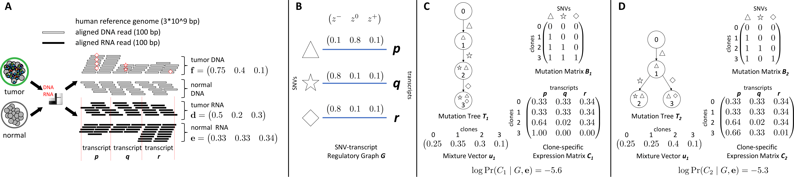

# PBDRJD -- Phylogenetic  Bulk  DNA-RNA  Joint  Deconvolutio
PBDRJD is an algorithm for phylogenetic inference of clone-specific expression and mutationprofiles using matched RNA and DNA bulk sequencing samples.

